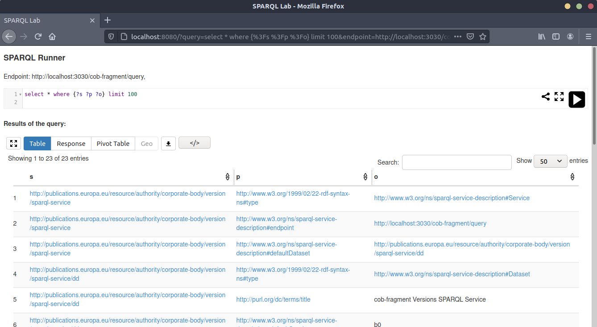

# Meaningfy's SPARQL GUI 

A lightweight GUI to load queries from repositories on the web into an IDE-like environment in your browser.

## Description
This project provides mainly glue code. It makes heavy use
of Laurens Rietveld's great [YASQE](http://yasqe.yasgui.org/) and
[YASR](http://yasr.yasgui.org/) javascript libraries, part of his
[YASGUI](http://yasgui.org) project.

Read more about the SPARQL GUI here: https://zbw.eu/beta/sparql-lab/about/
> This fork uses an NGINX docker image to run the service.



## Installation
---
Make sure that you are running `Docker` and have the correct permissions set.

```bash
sudo apt -y install docker.io docker-compose

sudo groupadd docker
sudo usermod -aG docker $USER
newgrp docker
```
---

To run the project:
```bash
docker-compose up --build
```
The service will be available at: [localhost:8080](http://localhost:8080)

## Usage
### URL arguments

The script is controlled by the following URL arguments:  

Argument | Description
---------|------------
`endpoint` | URL of a SPARQL endpoint *(defaults to an endpoint with the STW version history)*. Remote endpoints have to be [CORS](https://en.wikipedia.org/wiki/Cross-origin_resource_sharing) enabled.
`query`    | URL-encoded query text *(takes precedence over queryRef if both are defined, defaults to the YASQE built-in example query if neither)*.
`queryRef` | URL of a query on the web (no default). Works with GitHub API as in the example below, and presumably with other public repository URLs (CORS on the repository server required).
`hide`     | With `hide=1`, the query pane is hidden from display (defaults to hide=0).

### Example:

- [Added concepts](http://localhost:8080/?endpoint=http://zbw.eu/beta/sparql/stwv/query&queryRef=https://api.github.com/repos/jneubert/skos-history/contents/sparql/added_concepts.rq)

## Authors and acknowledgment
Forked from: [ZBW - Leibniz Information Centre for Economics](https://github.com/zbw/sparql-gui-gh)

Adapted by: [Meaningfy](https://github.com/meaningfy-ws)